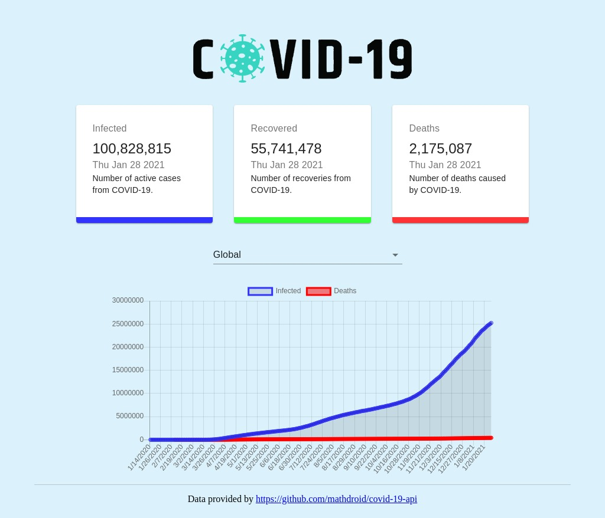

# COVID-19 Tracker

A simple dashboard displaying data regarding COVID-19 and where each country stands in terms of the current number of infections, recoveries, and deaths.

## Background

When building this project, I learned more about how to build charts, the basics of React, and became familiar with using Material UI to create a nice looking and clean design.

## Technologies

This project was created with:

- React
- Material UI
- Charts.js

## Notes

The API provides _some_ incomplete data, mainly recovery data for a handful of specific countries, such as the United States and Sweden.

## Credits/Acknowledgements

This project was inspired by and built with the help of a tutorial by [Javascript Mastery](https://www.youtube.com/watch?v=khJlrj3Y6Ls) and this API found [here](https://github.com/mathdroid/covid-19-api).
